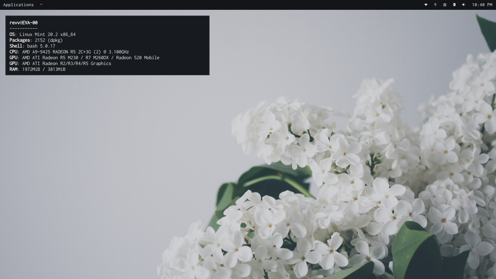
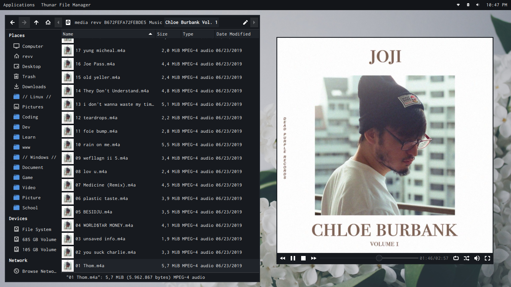
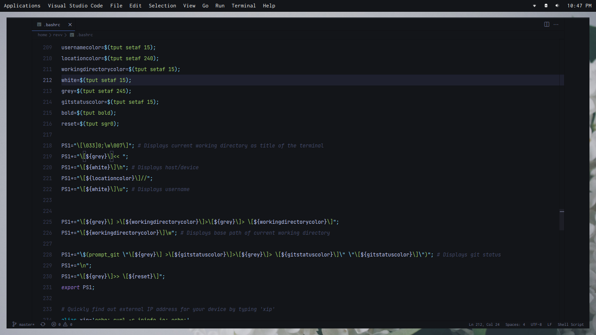
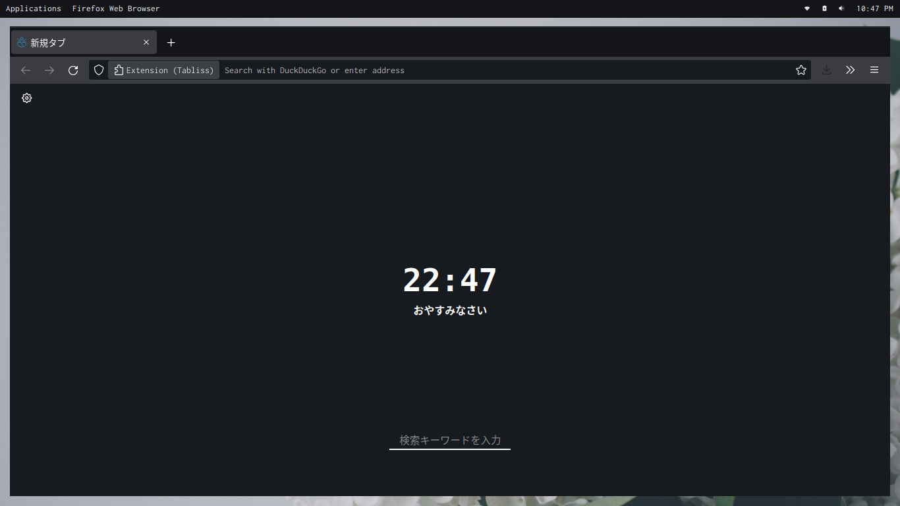

## System Info</h1>

+ **OS**: [Linux Mint](https://linuxmint.com/)
+ **DE** : [XFCE](https://xfce.org/)
+ **Panel** [XFCE-Panel](https://github.com/linuxmint/xfce-panel)
+ **WM** : [XFWM](https://github.com/xfce-mirror/xfwm4)
+ **Font**: [Inconsolata](https://fonts.google.com/specimen/Inconsolata)
+ **Text Editor**: [Visual Studio Code](https://github.com/Microsoft/vscode)
+ **Browser**: [Firefox](https://github.com/mozilla)
+ **GTK Theme**: [Oomox Modified](https://github.com/themix-project/oomox)
+ **File Manager**: [Thunar](https://github.com/xfce-mirror/thunar)
+ **Terminal**: Terminator

 

## Screenshot

        
        
        
        

 
